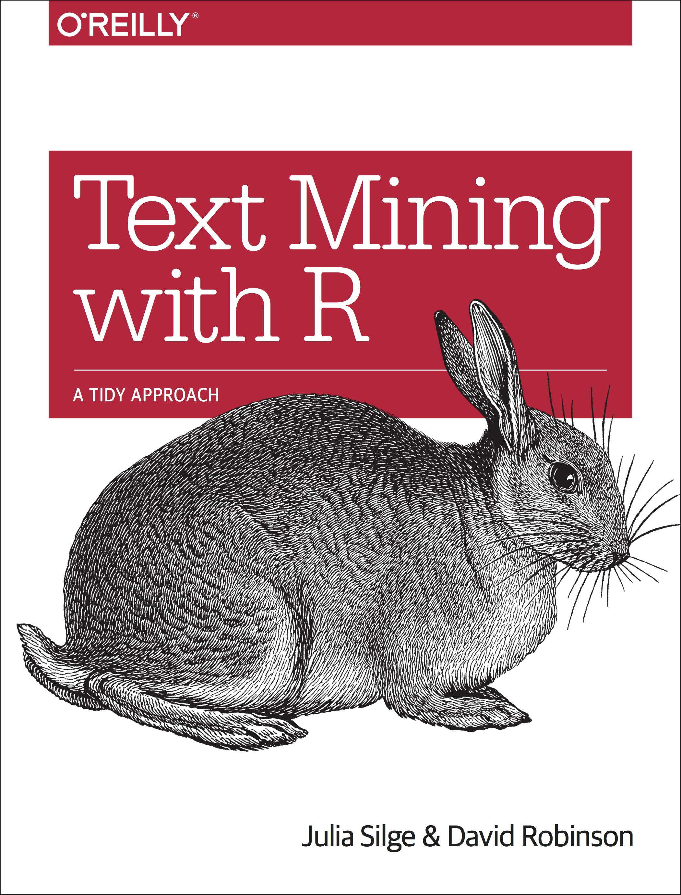

```{r, echo = FALSE, warning = FALSE}
library(knitr)
knitr::opts_chunk$set(cache = TRUE, warning = FALSE, message = FALSE, dpi = 180)
options(width=80)
library(ggplot2)
library(silgelib)
theme_set(theme_plex())
```


## Text Mining with Tidy Data Principles { .cover }


### Julia Silge (Stack Overflow)

#### [\@juliasilge](https://twitter.com/juliasilge)

#### [https://juliasilge.com/](https://juliasilge.com/)

## Let's install some packages

```{r, eval=FALSE}
install.packages(c("tidyverse", 
                   "tidytext", 
                   "gutenbergr"))
```


# tidy data principles + text mining = `r emo::ji("tada")`

##  { .white }


- [https://github.com/juliasilge/tidytext](https://github.com/juliasilge/tidytext)
- [http://tidytextmining.com/](http://tidytextmining.com/)


##  { .black }




## What do we mean by tidy text?


```{r}
text <- c("Because I could not stop for Death -",
          "He kindly stopped for me -",
          "The Carriage held but just Ourselves -",
          "and Immortality")

text
```

## What do we mean by tidy text?


```{r}
library(tidyverse)
text_df <- data_frame(line = 1:4, text = text)

text_df
```


## What do we mean by tidy text?

```{r}
library(tidytext)

text_df %>%
    unnest_tokens(word, text)
```


## Gathering more data

You can access the full text of many public domain works from [Project Gutenberg](https://www.gutenberg.org/) using the [gutenbergr](https://ropensci.org/tutorials/gutenbergr_tutorial.html) package.

```{r}
library(gutenbergr)

full_text <- gutenberg_download(1342)
```

What book do *you* want to analyze today? `r emo::ji_glue(":book: :partying: :book:")`

## Time to tidy your text!

```{r}
tidy_book <- full_text %>%
    mutate(line = row_number()) %>%
    unnest_tokens(word, text)

tidy_book
```

## What are the most common words?

```{r}
tidy_book %>%
    count(word, sort = TRUE)
```


## Stop words


## Stop words

```{r}
get_stopwords()
```

## Stop words

```{r}
get_stopwords(language = "pt")
```

## Stop words

```{r}
get_stopwords(source = "smart")
```


## What are the most common words?

```{r}
tidy_book %>%
    anti_join(get_stopwords(source = "smart")) %>%
    count(word, sort = TRUE)
```


## What are the most common words?

```{r, eval = FALSE}
tidy_book %>%
    anti_join(get_stopwords(source = "smart")) %>%
    count(word, sort = TRUE) %>%
    top_n(20) %>%
    ggplot(aes(fct_reorder(word, n), n)) +
    geom_col() +
    coord_flip()
```


## { .white }

<div class="fullpage width">
```{r, echo = FALSE, fig.width=7, fig.height=5}
tidy_book %>%
    anti_join(get_stopwords(source = "smart")) %>%
    count(word, sort = TRUE) %>%
    top_n(20) %>%
    ggplot(aes(fct_reorder(word, n), n)) +
    geom_col(fill = "midnightblue", alpha = 0.9) +
    coord_flip() +
    scale_y_continuous(expand = c(0,0)) +
    labs(x = NULL, y = "Number of occurrences")
```
</div>


## { .white }


## { .white }


# Sentiment analysis `r emo::ji_glue(":smile: :cry: :angry:")`


## Sentiment lexicons

<div class="double">
<p class="double-flow">
```{r}
get_sentiments("afinn")
```

</p><p class="double-flow">
```{r}
get_sentiments("bing")
```
</p>
</div>

## Sentiment lexicons

<div class="double">
<p class="double-flow">
```{r}
get_sentiments("nrc")
```

</p><p class="double-flow">
```{r}
get_sentiments("loughran")
```
</p>
</div>


## Implementing sentiment analysis

```{r}
tidy_book %>%
    inner_join(get_sentiments("bing")) %>%
    count(sentiment, word, sort = TRUE)
```


## Implementing sentiment analysis

```{r, eval = FALSE}
tidy_book %>%
    inner_join(get_sentiments("bing")) %>%
    count(sentiment, word, sort = TRUE) %>%
    group_by(sentiment) %>%
    top_n(10) %>%
    ungroup %>%
    ggplot(aes(fct_reorder(word, n), n, fill = sentiment)) +
    geom_col() +
    coord_flip() +
    facet_wrap(~ sentiment, scales = "free") 
```

## { .white }

<div class="fullpage width">
```{r, echo = FALSE, fig.width=8, fig.height=5}
tidy_book %>%
    inner_join(get_sentiments("bing")) %>%
    count(sentiment, word, sort = TRUE) %>%
    group_by(sentiment) %>%
    top_n(10) %>%
    ungroup %>%
    ggplot(aes(fct_reorder(word, n), n, fill = sentiment)) +
    geom_col(alpha = 0.9, show.legend = FALSE) +
    coord_flip() +
    facet_wrap(~ sentiment, scales = "free") +
    scale_y_continuous(expand = c(0,0)) +
    labs(x = NULL, y = "Number of occurrences")

```
</div>

# What is a document about? `r emo::ji("thinking")`


## What is a document about?

- Term frequency
- Inverse document frequency

\[ idf(\text{term}) = \ln{\left(\frac{n_{\text{documents}}}{n_{\text{documents containing term}}}\right)} \]

tf-idf is about comparing **documents** within a **collection**.

## Understanding tf-idf

Make a collection (*corpus*) for yourself! `r emo::ji("nail")`

```{r}
full_collection <- gutenberg_download(c(1342, 158, 161, 141),
                                      meta_fields = "title")

full_collection
```

## Counting word frequencies in your collection

```{r}
book_words <- full_collection %>%
    unnest_tokens(word, text) %>%
    count(title, word, sort = TRUE)

book_words
```


## Calculating tf-idf

That's... super exciting???

```{r}
book_words <- book_words %>%
    bind_tf_idf(word, title, n)

book_words
```

## Calculating tf-idf

```{r}
book_words %>%
    arrange(-tf_idf)
```


## Calculating tf-idf

```{r, eval = FALSE}
book_words %>%
    group_by(title) %>%
    top_n(10) %>%
    ungroup %>%
    ggplot(aes(fct_reorder(word, tf_idf), tf_idf, 
               fill = title)) +
    geom_col(show.legend = FALSE) +
    coord_flip() +
    facet_wrap(~title, scales = "free")
```

## { .white }

<div class="fullpage width">
```{r, echo=FALSE}
book_words %>%
    group_by(title) %>%
    top_n(10) %>%
    ungroup %>%
    ggplot(aes(fct_reorder(word, tf_idf), tf_idf, 
               fill = title)) +
    geom_col(alpha = 0.9, show.legend = FALSE) +
    coord_flip() +
    facet_wrap(~title, scales = "free") +
    scale_y_continuous(expand = c(0,0)) +
    labs(x = NULL, y = "tf-idf")
```
</div>


##  { .white }


## N-grams... and beyond! `r emo::ji("rocket")`

```{r}
tidy_ngram <- full_text %>%
    unnest_tokens(bigram, text, token = "ngrams", n = 2)

tidy_ngram
```

## N-grams... and beyond! `r emo::ji("rocket")`

```{r}
tidy_ngram %>%
    count(bigram, sort = TRUE)
```

## N-grams... and beyond! `r emo::ji("rocket")`

```{r}
tidy_ngram %>%
    separate(bigram, c("word1", "word2"), sep = " ") %>%
    filter(!word1 %in% stop_words$word,
           !word2 %in% stop_words$word) %>%
    count(word1, word2, sort = TRUE)
```

## What can you do with n-grams?

- tf-idf of n-grams
- network analysis
- negation

##  { .white }


## What can you do with n-grams?

### [She Giggles, He Gallops](https://pudding.cool/2017/08/screen-direction/)


# Tidying & casting

##  { .white }


##  { .white }


##  { .white }


# THANK YOU `r emo::ji("pray")`
